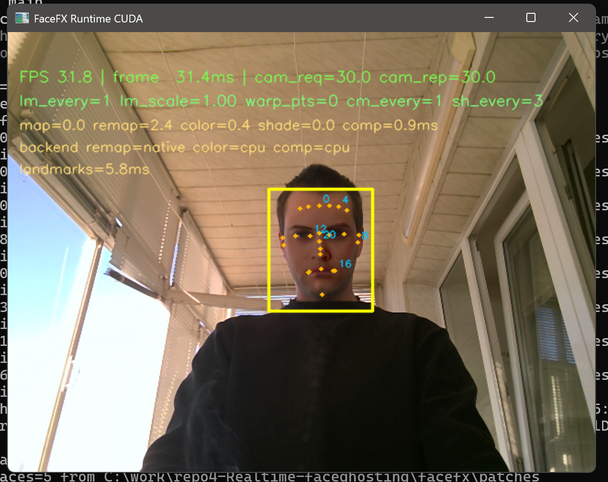

# FaceFX (real-time patch-warp pipeline)



Windows Python FaceMesh patch-warp pipeline (OpenCV + MediaPipe + SciPy) with runtime performance knobs.

## Current Runtime

- Main runtime in this repo: `python -m facefx.runtime_cuda.app`
- Main code path: `facefx/runtime_cuda/*`
- Status: current active live pipeline
- Legacy path still exists in the repo, but it is kept mainly for reference, comparison, and fallback

## Runtime CUDA v1 contract

The runtime-only CUDA pipeline contract is frozen in:

- `docs/runtime_cuda_contract.md`

It defines fixed v1 decisions for backend, adaptive ROI, landmark cadence, performance targets, and legacy coexistence requirements.

## Runtime CUDA (current)

Use the new runtime entrypoint:

```
python -m facefx.runtime_cuda.app
```

Working live preset (camera `1`) that currently gives about `~30 FPS` on this machine at `720x540`:

```
python -m facefx.runtime_cuda.app --camera 1 --device cuda --input-width 720 --input-height 540 --camera-fps 30 --profile --debug-overlay roi --landmark-every 1 --landmark-scale 1.0 --landmark-smooth 0.25 --color-match-every 1 --shading-every 3 --composite-backend auto --composite-cuda-min-area 60000
```

Notes:
- `M` rotates debug passes (`input -> warp -> alpha -> color -> final`).
- `N` returns to final pass (recommended for FPS measurement).
- Camera is hardcoded to index `1` in runtime_cuda.

Validation snapshot (`2026-03-09`):
- tests: `python -m pytest -q facefx/tests/runtime_cuda` -> `78 passed`
- tests: `python -m pytest -q facefx/tests` -> `96 passed`
- camera raw fps (`dshow`, requested `720x540@30`, camera `1`):
  - actual capture mode: `640x480@30`
  - `avg_read_fps`: `30.01`
  - `wall_fps_including_loop`: `29.67`
  - report: `scripts/baseline_artifacts/20260309T132017Z/camera_raw_fps.json`

## Architecture

```
facefx/
  main.py                 # legacy entry point
  requirements.txt        # runtime deps (mediapipe pinned)
  requirements-dev.txt    # gates (ruff/pytest)
  pyproject.toml          # ruff config
  patches/                # patch PNG/JPG assets (user-provided)
    .gitkeep
  src/
    __init__.py           # exports
    facemesh.py           # MediaPipe FaceMesh wrapper (live + static)
    regions.py            # region masks
    triangulation.py      # Delaunay + cached/fixed topology helpers
    warp.py               # piecewise affine warp
    blend.py              # feather blend/composite + color match
    patchbank.py          # patch loader + landmark cache
    ui.py                 # minimal UI helpers
  runtime_cuda/
    app.py                # current runtime entry point
    config.py             # runtime-only config
    pipeline.py           # runtime-only pipeline orchestration
    warp.py               # runtime warp helpers
    color.py              # runtime color/shading stage
    composite.py          # runtime composite stage
  tests/
    test_imports.py        # import smoke test
```

## Requirements

Install runtime deps (note mediapipe pin):

```
python -m pip install -r facefx/requirements.txt
```

Dev deps (gates):

```
python -m pip install -r facefx/requirements-dev.txt
```

## Performance hotspots (before optimization)

Primary costs in the original pipeline:

- per-frame SciPy `Delaunay(...)` on full landmark sets (`468/478` points)
- Python loop over all triangles (`warpAffine` + mask blend per triangle)
- full-frame region masks / intermediates each frame
- LAB color matching with repeated `meanStdDev` calls

Implemented optimizations in this repo:

- cached triangulation (`--topology frozen`) or fixed MediaPipe topology (`--topology mediapipe`)
- region subset triangle filtering (`--region`)
- ROI-buffer pipeline for masks/warp/blend
- downscaled FaceMesh input (`--scale`)
- optional reduced color-match cadence (`--color-match-every`)
- optional shading disable (`--shading off`)

## Legacy Pipeline (reference)

The older pipeline is still present for comparison and fallback:

```
python -m facefx.main
```

Code path:

- `facefx/main.py`
- `facefx/src/*`

## Legacy Run

Preferred (from repo root):

```
python -m facefx.main
```

Show CLI options (non-interactive smoke-safe):

```
python -m facefx.main --help
python -m facefx.main --dry-run
```

Second camera:

```
python -m facefx.main --camera 1
```

## Legacy Performance Knobs

Common speed-first preset (CPU):

```
python -m facefx.main --scale 0.5 --refine-landmarks off --topology frozen --region all --color-match-every 2 --shading off
```

Show per-stage timings and FPS overlay:

```
python -m facefx.main --profile
```

Non-interactive smoke/dry-run:

```
python -m facefx.main --dry-run
```

## Legacy CUDA (optional)

This project does not have a "switch" that makes the whole pipeline run on CUDA.

Notes:
- MediaPipe FaceMesh (Python) is typically CPU-bound.
- The warp pipeline uses many small per-triangle warps; pushing those to GPU is non-trivial and may not be faster.
- A small subset of operations can use OpenCV CUDA when available (example: large Gaussian blurs for shading).

Enable optional CUDA accelerations:

```
python -m facefx.main --device cuda
```

Verify whether your OpenCV is CUDA-enabled:

```
python -c "import cv2; print(getattr(cv2.cuda,'getCudaEnabledDeviceCount', lambda: 0)())"
```

If this prints `0`, your OpenCV build is not CUDA-enabled (the default `opencv-python` wheel is CPU-only). You'll need a CUDA-enabled OpenCV build to use `--device cuda`.

OBS: capture the app window.

## Runtime CUDA: Optional native IDW backend (C++)

`facefx/runtime_cuda/warp.py` can use an optional native DLL for dense IDW map building.
If the DLL is missing, it falls back to NumPy automatically.

Build (Windows, MSVC `cl.exe`):

```
powershell -ExecutionPolicy Bypass -File scripts/build_runtime_cuda_native.ps1
```

By default, runtime looks for:

- `facefx/runtime_cuda/native/facefx_runtime_cuda_native.dll`

You can override the path with:

```
set FACEFX_RUNTIME_NATIVE_DLL=C:\path\to\facefx_runtime_cuda_native.dll
```

## Legacy CLI performance knobs

Current runtime flags (defaults preserve prior behavior as closely as possible):

- `--profile` (default `off`): show FPS/frame time and stage timings on-screen
- `--scale <float>` (default `1.0`): run FaceMesh on downscaled frame and scale landmarks back (`0 < scale <= 1.0`)
- `--refine-landmarks {on,off}` (default `on`): MediaPipe refined landmarks (iris points)
- `--topology {frozen,mediapipe}` (default `frozen`)
  - `frozen`: compute Delaunay once and reuse simplices
  - `mediapipe`: fixed triangle list derived from MediaPipe tessellation (no runtime Delaunay)
- `--region {forehead,eyes,mouth,all}` (default `all`): limits masks and triangle loop to selected region(s)
- `--color-match-every N` (default `1`): run LAB color match every `N` frames
- `--shading {on,off}` (default `on`): enable/disable low-frequency L-channel shading transfer

## Legacy Profiling overlay

Enable with:

```
python -m facefx.main --profile
```

Overlay includes smoothed FPS / frame ms and stage timings:

- `capture`
- `facemesh`
- `masks`
- `warp`
- `color_match`
- `blend`
- `display`

## Legacy Recommended presets

These are starting points. Tune for your camera / CPU / GPU / patch sizes.

- Target: `640x480 30fps` (your current target, CUDA-capable GPU system; pipeline remains CPU-heavy)
  - `python -m facefx.main --topology mediapipe --region all --scale 0.75 --profile`
- `720p 60fps` (aggressive quality/perf tradeoff)
  - `python -m facefx.main --scale 0.5 --refine-landmarks off --topology mediapipe --color-match-every 2 --shading off --profile`
- `1080p 30fps` CPU-oriented preset
  - `python -m facefx.main --scale 0.5 --refine-landmarks off --topology mediapipe --region all --color-match-every 2 --profile`
- `1080p 30fps` quality-first
  - `python -m facefx.main --scale 0.75 --topology frozen --color-match-every 1 --shading on --profile`

## Legacy Color + shading match

- Per-frame, ROI-only color transfer in LAB using masked mean/std.
- Optional shading match on L channel via low-frequency ratio.
- Additional runtime cadence/toggle:
  - `--color-match-every`
  - `--shading`
- Code-level tunables in `facefx/main.py`:
  - `COLOR_MATCH_AB` (0.3-0.7 recommended)
  - `SHADING_KERNEL` (31-81 typical)
  - `SHADING_CLAMP` (e.g., `0.6..1.6`)

## Smoke / gates (non-interactive)

Useful smoke commands for local verification:

```
python -m compileall -q facefx
python -c "import cv2, mediapipe, numpy; import scipy"
python -m facefx.main --help
```

## Notes

- Put patch PNG/JPG files into `facefx/patches/`.
- Use frontal faces for best alignment.
- If no patch has a detectable face, a procedural noise patch is used.
